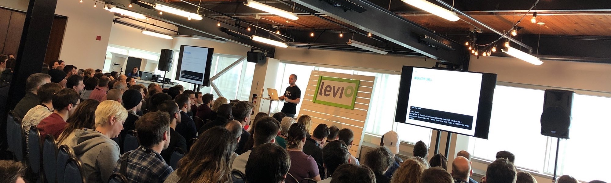

# Web “fonctionnel” et outils de développement

https://webaquebec.org/programmation/web-fonctionnel-et-outils-de-developpement

> Keynote + Code de ma présentation

## tl;dr

Survol des quatres outils indispensables pour assembler un _backend_ Web basé sur `Elixir`, un langage fonctionnel inspiré de `Ruby` qui est compilé en _bytecode_ pour `BEAM`, la machine virtuelle `Erlang`!

1. `iex`, _Interactive Shell_
1. [Ecto](https://hexdocs.pm/ecto), A database wrapper and language integrated query for Elixir.
1. [Phoenix](http://phoenixframework.org), A productive web framework that does not compromise speed and maintainability.
1. [Absinthe](http://absinthe-graphql.org), The GraphQL toolkit for Elixir

## 👋🏻

Si vous avez des questions ou des commentaires, n’hésitez pas à me contacter…

